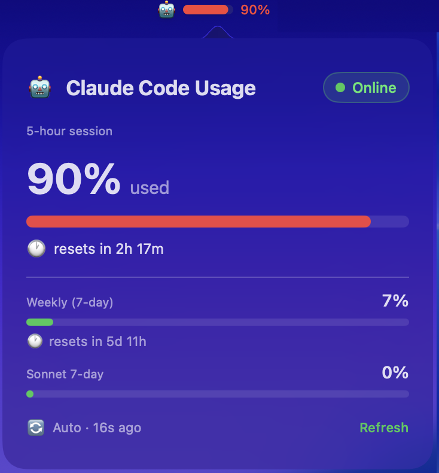
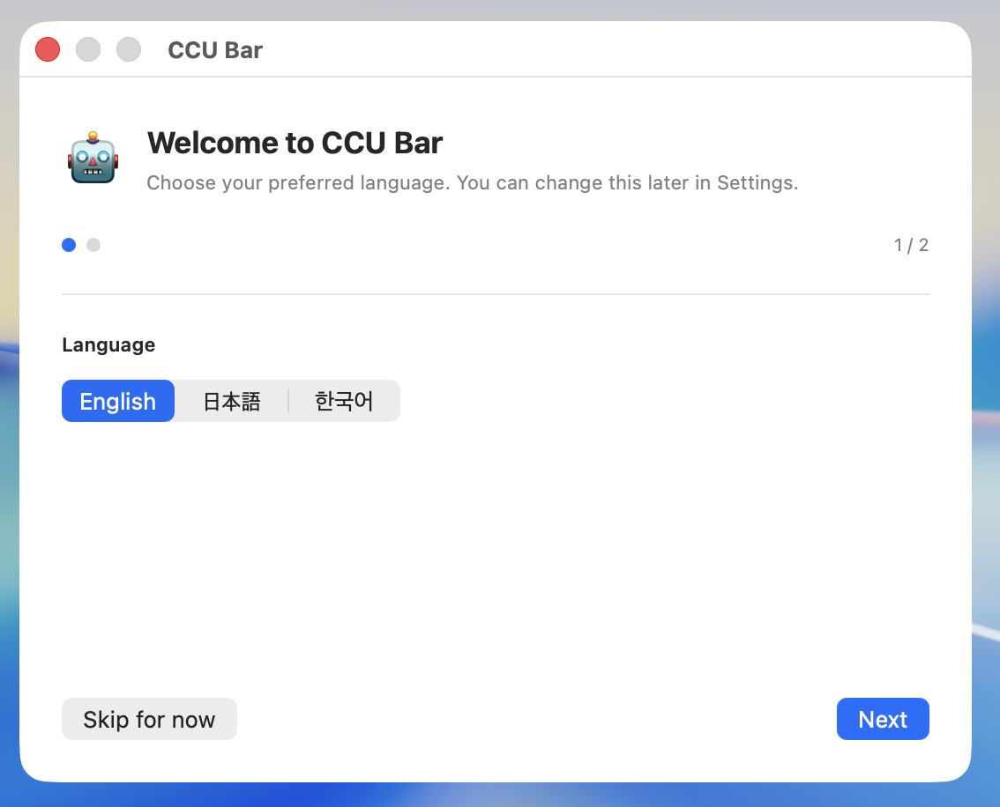
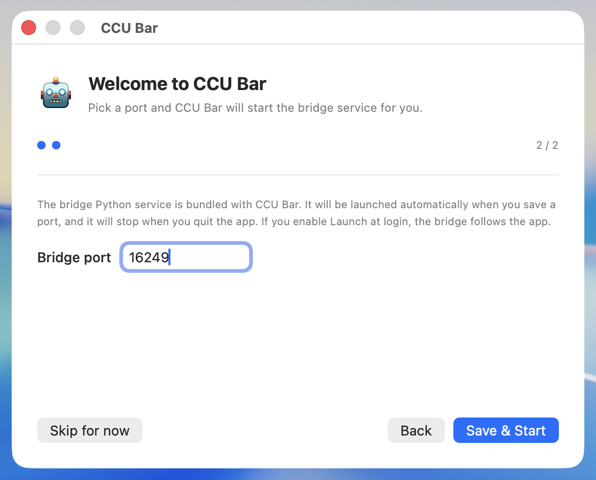
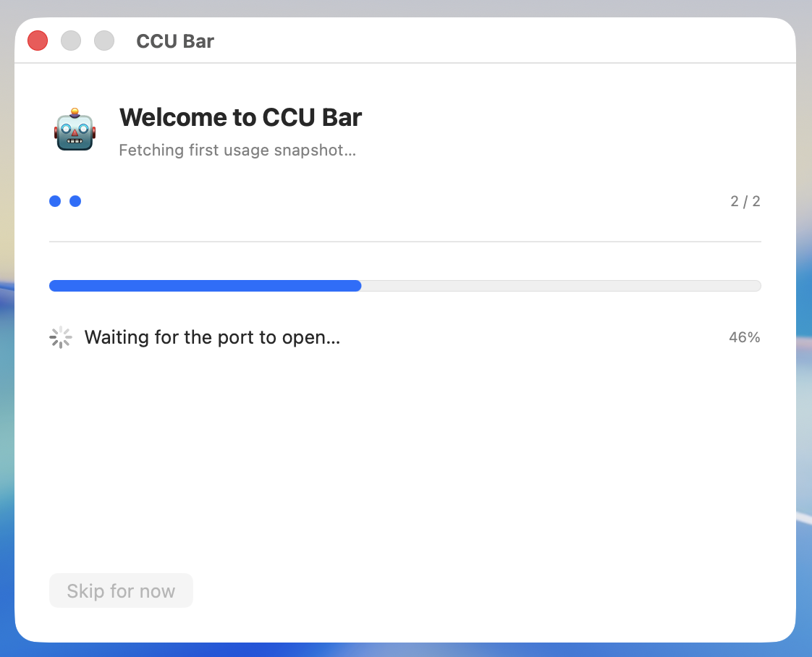
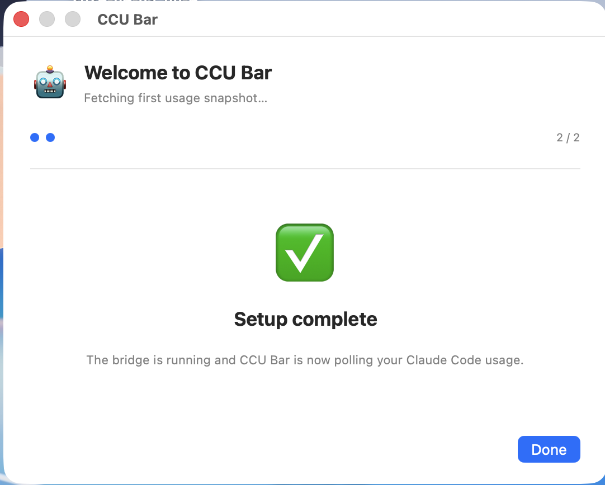

<h1 align="center">CCU Bar</h1>

<p align="center"><strong>Claude Code Usage Bar — Native macOS Menu-bar App</strong></p>

<p align="center">
  <a href="https://swift.org"></a>
  <a href="https://www.apple.com/macos/"></a>
  <a href="https://www.python.org/"></a>
  <a href="https://developer.apple.com/sf-symbols/"></a>
  <a href="LICENSE"></a>
</p>

**Claude Code Usage Bar** — a native macOS menu-bar app that shows your current Claude Code session quota at a glance.

The menu-bar item displays a compact progress bar (with optional percentage and 🤖 icon) that turns orange at 60 % and red at 85 %. Clicking it opens a translucent popover with three quotas:

- **5-hour session** — the rolling session window
- **Weekly (7-day)** — the combined weekly cap (Max plans)
- **Sonnet 7-day** — the Sonnet-specific weekly cap

<p align="center">
  
  <br />
  <em>Menu-bar indicator (top) and popover (3 quotas)</em>
</p>

---

## Features

- **Always-on menu bar gauge** — bar + percentage + 🤖 icon (all three toggleable in settings)
- **Three quota tracks** in the popover
  - 5-hour rolling session
  - 7-day weekly combined
  - 7-day Sonnet-only
- **Live progress bar** with tier colours (green → orange → red) that mirror the menu-bar state
- **Time-to-reset countdown** for each quota (e.g. "1h 23m until reset")
- **Auto-refresh** every 30 s / 60 s / 5 min (configurable); manual refresh button + right-click context menu
- **Threshold notifications** at 75 % and 90 % (once per session, auto-reset after session rollover)
- **Three-language UI** — English, Japanese, Korean — switchable live from Settings
- **Dark-mode HUD popover** (`.hudWindow` + `vibrantDark` appearance, regardless of system theme)
- **Launch at login** via `SMAppService`
- **Menu-bar icon toggle** — hide the 🤖 for minimal style
- **Display modes** — bar-only, number-only, or both
- **No data leaves your machine** — see [Architecture](#architecture)

---

## Requirements

### Runtime

| Requirement | Detail |
|---|---|
| **macOS** | 13 Ventura or newer |
| **Architecture** | Apple Silicon or Intel (fat binary when built with `--arch` flags) |
| **Data source** | A local HTTP service that returns Claude usage JSON **or** a claude.ai `sessionKey` cookie pasted into Settings. See [Data source](#data-source). |

### Build-from-source (optional)

| Requirement | Detail |
|---|---|
| **Swift** | 5.9 or newer (Xcode 15 / Command Line Tools for Xcode 15+) |
| **iconutil** | Ships with macOS; used to pack the icon |
| **curl** | Ships with macOS; used once to download the Twemoji SVG |

No third-party Swift packages. Only Foundation, AppKit, SwiftUI, Combine, UserNotifications, and ServiceManagement are linked.

---

## Data source

CCU Bar polls a tiny local HTTP service that exposes usage in the JSON shape shown below. The reference implementation — **claude-usage-bridge** — ships in the [`bridge/`](bridge/) subdirectory of this repo and is bundled inside the `.app`, so the app launches and manages it for you automatically.

> ⚠️ **claude-usage-bridge is an unofficial tool.** It scrapes your locally logged-in `claude.ai` cookie rather than calling the official Anthropic API. See [`bridge/README.md`](bridge/README.md) for the full risk statement.

Expected JSON from the bridge:

```json
{
  "five_hour":        { "utilization": 57, "remaining_minutes": 281,  "resets_at": "..." },
  "seven_day":        { "utilization": 84, "remaining_minutes": 301,  "resets_at": "..." },
  "seven_day_sonnet": { "utilization":  8, "remaining_minutes": 4801, "resets_at": "..." }
}
```

Any Flask/Node/Go service that produces the same format would work — CCU Bar only speaks HTTP over `127.0.0.1` on the port you configure.

---

## Installation

### Prerequisites

- macOS 13 Ventura or newer
- Xcode Command Line Tools (`xcode-select --install`) — gives you Swift 5.9+ and `iconutil`
- Python 3.8+ with pip — needed by the bundled bridge. If you use Homebrew: `brew install python3` already gives you what you need.

### Build and install

```bash
git clone https://github.com/peten486/CCUBar.git
cd CCUBar
./Scripts/build_app.sh                   # produces build/CCUBar.app
cp -R build/CCUBar.app /Applications/    # optional — or just run it in place
open /Applications/CCUBar.app            # or: open build/CCUBar.app
```

> ℹ️ On first launch macOS Gatekeeper may warn that the app is from an unidentified developer (ad-hoc signed, not notarised). Right-click `CCUBar.app` → **Open** → **Open** to approve it once; subsequent launches go through silently.

The first launch starts the initial setup wizard below.

### Initial setup (first launch)

The first time you open CCU Bar it walks you through a two-step wizard, then starts the bundled Python bridge and verifies the first API call end-to-end. If you've already completed this once, you can skip straight to [Usage](#usage).

<table>
<tr>
<td width="50%">
  
  <br />
  <strong>1. Language</strong><br />
  Choose English, Japanese, or Korean. The choice propagates to every window (popover, settings, notifications) immediately and can be changed later in Settings.
</td>
<td width="50%">
  
  <br />
  <strong>2. Bridge port</strong><br />
  CCU Bar pre-fills a random free port in the 49152–65500 range. Change it if you like, then click <em>Save &amp; Start</em>. No separate terminal step is required — the app launches the bundled Python bridge for you.
</td>
</tr>
<tr>
<td width="50%">
  
  <br />
  <strong>3. Startup progress</strong><br />
  The wizard spawns the bridge process, polls the port until it starts listening (up to 20 s), then exercises <code>/api/usage</code> with a 30 s timeout. The progress bar animates across these phases; the current phase is printed below.
</td>
<td width="50%">
  
  <br />
  <strong>4. Setup complete</strong><br />
  When the first API call succeeds the wizard stays on this screen until you click <em>Done</em>. CCU Bar is now polling your Claude Code usage on the menu bar.
</td>
</tr>
</table>

If step 3 fails (missing Python, missing pip dependencies, cookie access denied, etc.), the wizard switches to an error screen with <em>Install dependencies</em> and <em>Retry</em> buttons. <em>Install dependencies</em> runs <code>python3 -m pip install --user -r bridge/requirements.txt</code> and automatically retries.

---

---

## Privacy & Security permissions

CCU Bar itself does not phone home, but the bundled bridge needs to read the `sessionKey` cookie that `claude.ai` sets in your browser. macOS protects those files under Transparency-Consent-Control (TCC), so a few one-time permissions are required.

### Required

| Permission | Where to grant | Why |
|---|---|---|
| **Full Disk Access** | System Settings → Privacy & Security → **Full Disk Access** → add `CCUBar.app` | Needed to read `Cookies.binarycookies` for Safari users. Without it the bridge can still fall back to Chrome / Chromium, but the Safari path returns *Operation not permitted*. |
| **Notifications** | First launch shows a banner automatically — click **Allow**. Can be changed later in System Settings → Notifications → **CCU Bar** | Used for the 75 % / 90 % threshold alerts. |

### On demand (first-time prompts)

| Permission | When it appears | What to do |
|---|---|---|
| **Keychain → *Chrome Safe Storage*** | First time the bridge tries to decrypt Chrome cookies | Click **Always Allow** so the app can re-decrypt the cookie at every refresh without prompting again. If you miss the dialog, run `./bridge/refresh_keychain.sh` from a terminal to re-cache. |
| **Login Items** | When you toggle *Launch at login* in Settings | macOS may open *System Settings → General → Login Items* and list **CCU Bar**. Keep the switch **on**. |

### Not required

- **Accessibility** — not used
- **Camera / Microphone / Screen Recording** — not used
- **Internet / outbound network access** — the app talks only to `127.0.0.1:<bridge-port>`; the bridge talks to `claude.ai` on your behalf with your session cookie

### If something fails

| Symptom | Fix |
|---|---|
| Onboarding step 3 fails with "bridge did not open port" | Usually a Python dependency issue — click **Install dependencies** on the failure screen |
| `app.log` reports a Safari cookie read failure (`Operation not permitted`) | Grant **Full Disk Access** to `CCUBar.app` and retry from Settings → Randomize/Change |
| Menu-bar bar never updates after enabling *Launch at login* | Make sure the app lives at `/Applications/CCUBar.app` (required by `SMAppService`). Moving or renaming the bundle breaks the login item |

---

## Usage

- **Click** the menu-bar item → opens the popover with all three quotas.
- **Right-click** (or **⌃-click**) → context menu with Refresh / Settings / Quit.
- **Right-click the popover’s "Refresh" button** → same context menu inside the popover.
- **Settings** — change language, menu-bar display (bar / number / both), icon visibility, refresh interval, `claude` CLI path override, notifications, and login-at-startup.
- Settings persist to `UserDefaults` under the key `ccubar.settings.v1` and migrate automatically from the legacy `ccbar.settings.v1` key if present.

Thresholds 75 % and 90 % each fire a single `UNUserNotificationCenter` alert, deduped until the session resets (detected by a monotonically-decreasing session percent or a changed `resets_at`).

---

## Architecture

```
┌─────────────────────────────────────────────────────┐
│                   CCUBarApp (@main)                 │
│      AppDelegate + MenuBarController + BridgeRunner │
└───────┬───────────────────┬────────────────┬────────┘
        │                   │                │
        ▼                   ▼                ▼
┌───────────────┐   ┌───────────────┐   ┌──────────────┐
│ UsageStore    │   │ SettingsStore │   │ Notifier     │
│ (@Published)  │   │ UserDefaults  │   │ UN center    │
└──────┬────────┘   └───────────────┘   └──────────────┘
       ▼
┌───────────────────┐     ┌──────────────┐
│ BridgeFetcher     │ ──▶ │ HttpUsageFtchr│  URLSession → /api/usage
│ (reads port       │     └──────────────┘
│  from Settings)   │
└───────────────────┘                    ┌──────────────────────────┐
                                         │ bridge/ (Python, Flask)  │
                                         │ spawned by BridgeRunner  │
                                         └──────────────────────────┘
```

Key components:

| File | Responsibility |
|---|---|
| `Sources/CCUBar/App/CCUBarApp.swift` | `@main`, `Settings {}` scene |
| `Sources/CCUBar/App/AppDelegate.swift` | DI wiring, bridge bootstrap, accessory activation policy |
| `Sources/CCUBar/MenuBar/MenuBarController.swift` | `NSStatusItem`, popover, context menu |
| `Sources/CCUBar/MenuBar/StatusItemProgressView.swift` | Custom `NSView` progress-bar renderer |
| `Sources/CCUBar/Popover/PopoverView.swift` | SwiftUI popover (three quotas + dark HUD) |
| `Sources/CCUBar/Popover/OnboardingView.swift` | Two-step first-launch wizard (language + port) |
| `Sources/CCUBar/Popover/SettingsView.swift` | Settings window |
| `Sources/CCUBar/Core/BridgeRunner.swift` | Spawns/terminates the Python bridge; port + orphan cleanup |
| `Sources/CCUBar/Core/HttpUsageFetcher.swift` | HTTP client for `/api/usage` |
| `Sources/CCUBar/Core/UsageFetcher.swift` | `UsageFetching` protocol + `BridgeFetcher` thin wrapper |
| `Sources/CCUBar/Core/UsageStore.swift` | `@Published` state, threshold detection, retry backoff |
| `Sources/CCUBar/Core/Notifier.swift` | `UNUserNotificationCenter` wrapper |
| `Sources/CCUBar/Core/PipInstaller.swift` | Async `pip install --user -r requirements.txt` helper |
| `Sources/CCUBar/Core/IssueReporter.swift` | Composes a pre-filled GitHub issue URL with log tail |
| `Sources/CCUBar/Core/LoginItemManager.swift` | `SMAppService.mainApp` wrapper |
| `Sources/CCUBar/Utilities/Localization.swift` | Three-language string catalogue |
| `Sources/CCUBar/Utilities/GaugeRenderer.swift` | Percent → tier/colour + label formatter |

All business logic lives in free structs/actors; UI types depend on them and are fully testable.

---

## Project layout

```
Claude_Usage_Monitor/
├── Package.swift
├── README.md                      ← this file
├── NOTICE.md                      ← SF Symbols / emoji attribution
├── LICENSE                        ← MIT
├── Sources/CCUBar/                ← app target
│   ├── App/                       (@main + AppDelegate)
│   ├── MenuBar/                   (NSStatusItem + progress view)
│   ├── Popover/                   (Popover, Onboarding, Settings)
│   ├── Core/                      (BridgeRunner, fetchers, store, notifier,
│   │                               PipInstaller, IssueReporter, LoginItem)
│   ├── Models/                    (UsageSnapshot, FetchState, Settings)
│   └── Utilities/                 (GaugeRenderer, Localization)
├── Tests/CCUBarTests/             ← 16 unit tests + 1 opt-in live test
├── Resources/
│   └── AppIcon.icns               ← generated from SF Symbol
├── bridge/                        ← bundled Python service (see bridge/README.md)
│   ├── claude_usage_scraper.py    ← Flask server + cookie extractor
│   ├── requirements.txt
│   ├── run.sh / stop.sh / refresh_keychain.sh
│   └── token.ini.example
└── Scripts/
    ├── build_app.sh               ← Swift build + bundle assembly
    ├── generate_app_icon.sh       ← SF Symbol → iconset → .icns
    ├── generate_sf_symbol_icon.swift
    └── Info.plist.template
```

---

## Development

```bash
swift build                # compile (debug)
swift test                 # 16 unit tests, <0.1 s total
swift test --filter Xxx    # filter by suite/test

# Opt-in: hit the live bridge running on <port>
CCUBAR_LIVE_PORT=65136 swift test --filter LiveFetchTests

./Scripts/build_app.sh     # build + bundle the .app
```

Tests are in pure XCTest and use protocol-based fakes (`UsageFetching` / `NotificationDispatching`) — no UI harness needed.

---

## Troubleshooting

| Symptom | Fix |
|---|---|
| Menu-bar shows `Setup` / no bar | Open Settings and confirm the Bridge port is set; check that the Running chip is green |
| Menu-bar shows `…` forever | Check `~/Library/Application Support/CCUBar/bridge/bridge_stderr.log` and `app.log` for the bridge's own error trail |
| Popover renders light-grey | Make sure you're running the latest build; older revisions didn't force `vibrantDark` |
| Notification not firing | Check *System Settings → Notifications → CCU Bar* is allowed; the first launch asks once |
| Icon didn't update in Finder | `touch build/CCUBar.app && killall Finder` (or re-register via `lsregister`) |
| Login-item toggle fails | Bundle must live at a stable location — move `CCUBar.app` to `/Applications` first |

---

## Limitations & roadmap

- **Hard dependency on the bundled bridge** — by design, since Claude Code's `/usage` slash-command isn't exposed non-interactively. If Anthropic publishes a machine-readable endpoint, the bridge can be replaced with a direct call.
- **No historical chart** — each refresh is a point-in-time snapshot; sparkline support is a post-1.0 item.
- **No Windows / Linux support** — AppKit-native; would need a Tauri/Electron port.
- **No App Store build** — uses `SMAppService` in a way that needs `/Applications`, fine for direct download, not for sandboxed MAS distribution.

---

## License

Project source: [MIT License](LICENSE) — Copyright © 2026 peten486.

Third-party assets are listed in [NOTICE.md](NOTICE.md). The application icon is rendered from Apple's SF Symbols at build time; the 🤖 glyph in the menu bar is drawn from the system emoji font at runtime — no Apple graphics are embedded in the shipped bundle.
